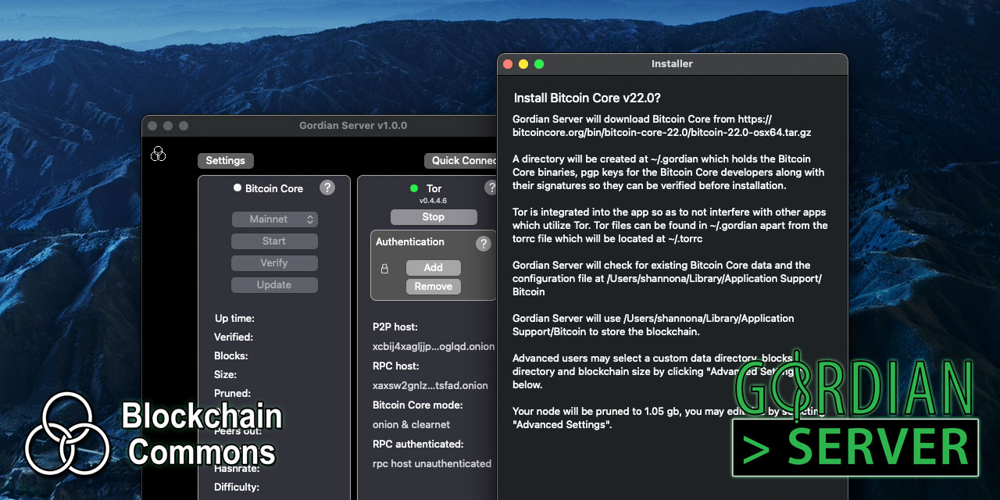
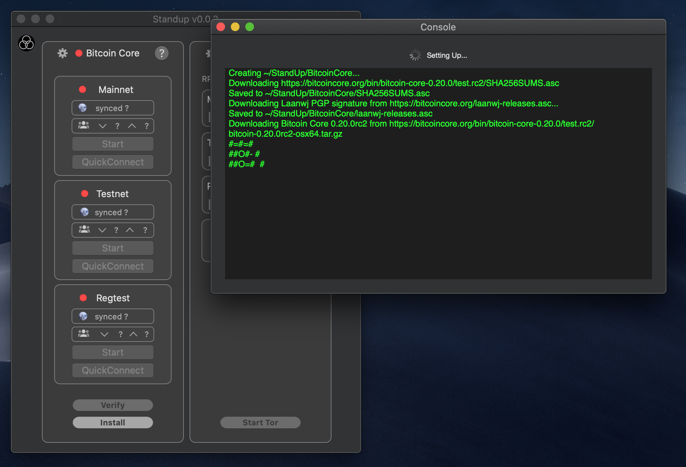
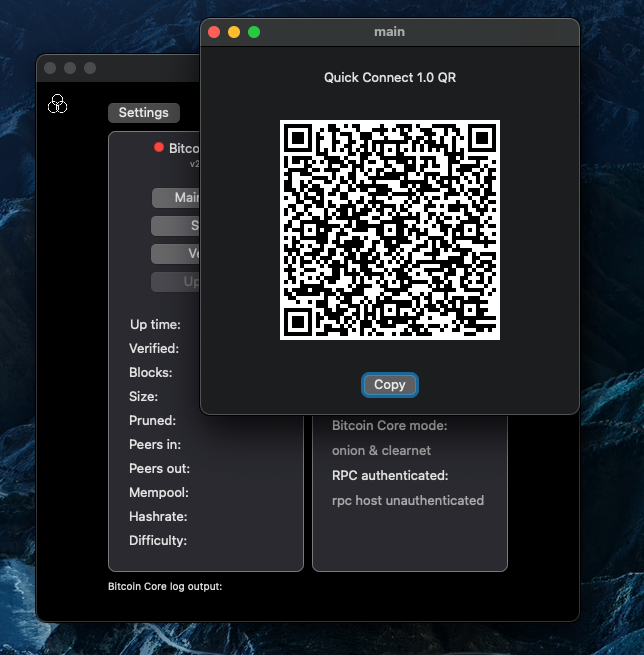
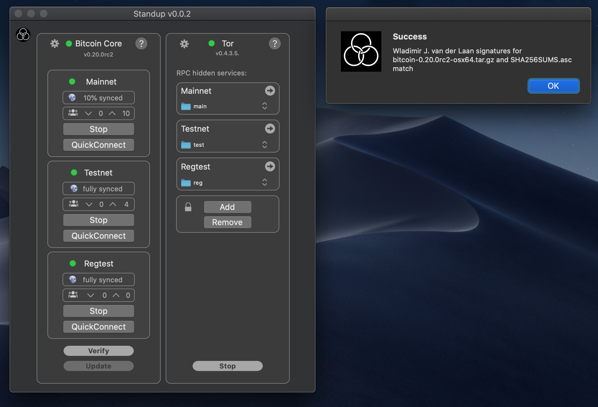
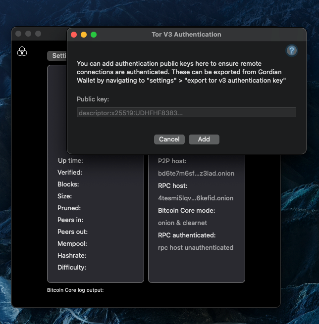

# 🛠 GordianServer-macOS

### _by [Peter Denton](https://github.com/Fonta1n3) and [Christopher Allen](https://github.com/ChristopherA)_
*  ***uses [gordian](https://github.com/BlockchainCommons/gordian/blob/master/README.md) technology***
*(Previously known as Bitcoin-Standup-macOS.)*

**_GordianServer-macOS_** is a open source project and a suite of tools that helps users to install a [Bitcoin-Core](https://bitcoin.org/) full-node on a fresh computer or VPS and to add important privacy tools like onion services. It will eventually also support optional Bitcoin-related tools like [Electrum Personal Server](https://github.com/chris-belcher/electrum-personal-server), [C-Lightning](https://github.com/ElementsProject/lightning), [Esplora](https://github.com/Blockstream/esplora), and [BTCPay Server](https://github.com/btcpayserver/btcpayserver) as well as emerging technologies like Bitcoin-based Decentralized Identifiers. *GordianServer-macOS* strives to provide the community with an easy-to-use "one-click" setup for a full node, complete with a purpose-built remote app for securely connecting to your node over Tor from anywhere in the world, providing you with a powerful suite of tools.

This tool will also harden and secure your OS to current best practices and will add sufficient system tools to support basic Bitcoin development. After setup, *GordianServer-macOS* will present a QR code and/or special URI that can be used to securely link your full-node to other devices, such as a remote desktop or a mobile phone using [Gordian Wallet 2](https://testflight.apple.com/join/OQHyL0a8) or [Fully Noded](https://apps.apple.com/us/app/fully-noded/id1436425586) on iOS.

This repo includes the *GordianServer-macOS*, which allows you to run a full node and Tor on your Mac computer.

## Additional Information

For more information on *GordianServer-macOS*:

1. [Using *GordianServer-macOS*](Docs/Using-GordianServer-macOS.md) provides basic description of functions and some FAQs.
2. [How *GordianServer-macOS* macOS Works](Docs/How-it-works.md) describes the specifics of what *GordianServer-macOS* does.
3. The [Main *Gordian* Repo](https://github.com/BlockchainCommons/GordianSystem) contains general information on the project.

## Status — Work-in-Progress

*GordianServer-macOS* is an early **Work-In-Progress**, so that we can prototype, discover additional requirements, and get feedback from the broader Bitcoin-Core Developer Community. ***It has not yet been peer-reviewed or audited. It is not yet ready for production uses. Use at your own risk.***

## Prerequisites

- macOS 10.10 Yosemite (not yet tested on versions older then Mojave but it should work)
- ~320 GB of free space for a full mainnet node with txindex; or ~30 GB for a full testnet3 node; or substantially less if the full node is pruned.
- In order to install *Bitcoin Core* and *Tor* on your behalf, *GordianServer-macOS* uses *Brew* and *XCode Command Line Tools*, these will be automatically downloaded and installed for you within the app using a popular well reviewed open sourced script called *Strap*, you can read more about *Strap* [here](https://github.com/MikeMcQuaid/strap/blob/master/README.md). In addition to installing *Brew* and *XCode Command Line Tools*, *Strap* also sets up your Macbook for best security practices; including full disc encryption with *FileVault*, enables *macOS Firewall* and disables *Java* for better security among others.

## Installation Instructions

You must meet minimum OS and space requirements to install *GordianServer-macOS* on your Mac, as described below.     

- minimum macOS 10.10 Yosemite (not yet tested on versions older then Mojave but it should work)
- Navigate to [Tagged release page v0.1.5](https://github.com/BlockchainCommons/GordianServer-macOS/releases/tag/v0.1.5)
- Click to download `GordianServer-macOS-v0.1.5.dmg`
- Double click the downloaded `GordianServer-macOS-v0.1.5.dmg` file. That's it.

`GordianServer-macOS-v0.1.5.dmg` has been pgp signed, the pgp signature can be viewed. It is on the [same release page](./releases/tag/v0.1.5) and named `GordianServer-macOS-v0.1.5.dmg.asc`

### Build Mac App from source using Xcode

Instead of downloading binaries through our Github repo, you can build *GordianServer-macOS* by hand using Apple's *Xcode*.

1. Install [*Xcode*](https://itunes.apple.com/id/app/xcode/id497799835?mt=12).
2.  [Create](https://developer.apple.com/programs/enroll/) a free Apple developer account.
3. Link your GitHub account
   - In *Xcode*, click "Xcode" > "preferences" and choose the "Accounts" tab.
   - Click "+" to link a new account.
   - Choose "GitHub".
   - Enter your GitHub credentials.
4. On [this GitHub repo](https://github.com/BlockchainCommons/GordianServer-macOS), click "Clone and Download" > "Open in Xcode".
   - If "Open in Xcode" does not show up as an option, try refreshing your browser's view of the GitHub repo
   - If that doesn't work, you can instead download a clone via "Source Control > Clone" within XCode.
5. When *Xcode* launches, press the "play" button in the top left.
   - If you had to download the clone by hand from within XCode, you'll likely need to navigate to the `xcodeproj` file in the `Xcode` directory.

### After Installation

Once the app has completely installed (by either method) and once it has launched *Bitcoin Core*, it will present a *Quick Connect QR code* that can be used to securely link your full node remotely over Tor to other devices, such as the iOS application [GordianWallet](https://github.com/BlockchainCommons/GordianWallet-iOS). *Standup* allows you to run all three Bitcoin networks (`mainnet`, `testnet` and `regtest`) simultaneously via its user interface. *GordianServer-macOS* will present an independent *Quick Connect QR code* for each network so that you may remotely connect to and utilize each.

## Financial Support

*GordianServer-macOS* is a project of [Blockchain Commons](https://www.blockchaincommons.com/). We are proudly a "not-for-profit" social benefit corporation committed to open source & open development. Our work is funded entirely by donations and collaborative partnerships with people like you. Every contribution will be spent on building open tools, technologies, and techniques that sustain and advance blockchain and internet security infrastructure and promote an open web.

To financially support further development of *GordianServer-macOS* and other projects, please consider becoming a Patron of Blockchain Commons through ongoing monthly patronage as a [GitHub Sponsor](https://github.com/sponsors/BlockchainCommons). You can also support Blockchain Commons with bitcoins at our [BTCPay Server](https://btcpay.blockchaincommons.com/).

## Contributing

We encourage public contributions through issues and pull requests! Please review [CONTRIBUTING.md](./CONTRIBUTING.md) for details on our development process. All contributions to this repository require a GPG signed [Contributor License Agreement](./CLA.md).

### Discussions

The best place to talk about Blockchain Commons and its projects is in our GitHub Discussions areas.

[**Gordian System Discussions**](https://github.com/BlockchainCommons/Gordian/discussions). For users and developers of the Gordian system, including the Gordian Server, Bitcoin Standup technology, QuickConnect, and the Gordian Wallet. If you want to talk about our linked full-node and wallet technology, suggest new additions to our Bitcoin Standup standards, or discuss the implementation our standalone wallet, the Discussions area of the [main Gordian repo](https://github.com/BlockchainCommons/Gordian) is the place.

[**Blockchain Commons Discussions**](https://github.com/BlockchainCommons/Community/discussions). For developers, interns, and patrons of Blockchain Commons, please use the discussions area of the [Community repo](https://github.com/BlockchainCommons/Community) to talk about general Blockchain Commons issues, the intern program, or topics other than the [Gordian System](https://github.com/BlockchainCommons/Gordian/discussions) or the [wallet standards](https://github.com/BlockchainCommons/AirgappedSigning/discussions), each of which have their own discussion areas.

### Other Questions & Problems

As an open-source, open-development community, Blockchain Commons does not have the resources to provide direct support of our projects. Please consider the discussions area as a locale where you might get answers to questions. Alternatively, please use this repository's [issues](./issues) feature. Unfortunately, we can not make any promises on response time.

If your company requires support to use our projects, please feel free to contact us directly about options. We may be able to offer you a contract for support from one of our contributors, or we might be able to point you to another entity who can offer the contractual support that you need.

### Credits

The following people directly contributed to this repository. You can add your name here by getting involved. The first step is learning how to contribute from our [CONTRIBUTING.md](./CONTRIBUTING.md) documentation.

| Name              | Role                | Github                                            | Email                                                       | GPG Fingerprint                                    |
| ----------------- | ------------------- | ------------------------------------------------- | ----------------------------------------------------------- | -------------------------------------------------- |
| Christopher Allen | Principal Architect | [@ChristopherA](https://github.com/ChristopherA) | \<ChristopherA@LifeWithAlacrity.com\>                       | FDFE 14A5 4ECB 30FC 5D22  74EF F8D3 6C91 3574 05ED |
| Peter Denton      | Project Lead        | [@Fonta1n3](https://github.com/Fonta1n3)          | <[fontainedenton@gmail.com](mailto:fontainedenton@gmail.com)> | 1C72 2776 3647 A221 6E02  E539 025E 9AD2 D3AC 0FCA  |

## Responsible Disclosure

We want to keep all of our software safe for everyone. If you have discovered a security vulnerability, we appreciate your help in disclosing it to us in a responsible manner. We are unfortunately not able to offer bug bounties at this time.

We do ask that you offer us good faith and use best efforts not to leak information or harm any user, their data, or our developer community. Please give us a reasonable amount of time to fix the issue before you publish it. Do not defraud our users or us in the process of discovery. We promise not to bring legal action against researchers who point out a problem provided they do their best to follow the these guidelines.

### Reporting a Vulnerability

Please report suspected security vulnerabilities in private via email to ChristopherA@BlockchainCommons.com (do not use this email for support). Please do NOT create publicly viewable issues for suspected security vulnerabilities.

The following keys may be used to communicate sensitive information to developers:

| Name              | Fingerprint                                        |
| ----------------- | -------------------------------------------------- |
| Christopher Allen | FDFE 14A5 4ECB 30FC 5D22  74EF F8D3 6C91 3574 05ED |

You can import a key by running the following command with that individual’s fingerprint: `gpg --recv-keys "<fingerprint>"` Ensure that you put quotes around fingerprints that contain spaces.
